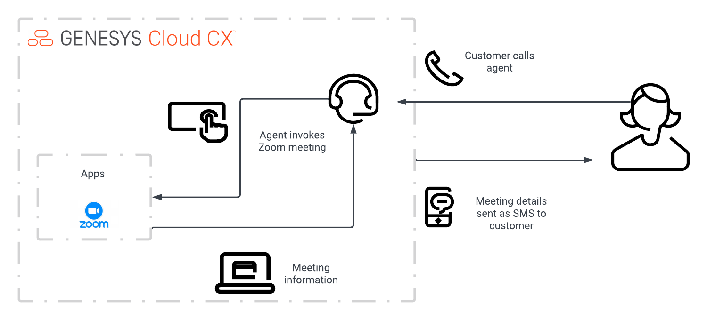

#  Set up a Zoom meeting on Genesys Cloud

The Genesys Cloud Developer Blueprint describes how agents can schedule meetings with customers using Zoom and Genesys Cloud. Genesys Cloud sends an SMS message to the customer with a meeting URL and opens Zoom for the agent. Calls in a queue can be inbound or outbound as long as they are in a queue.

> View the full [Zoom meeting on Genesys Cloud Blueprint article](https://developer.mypurecloud.com/blueprints/zoom-meetings-sms/) on the Genesys Cloud Developer Center.
